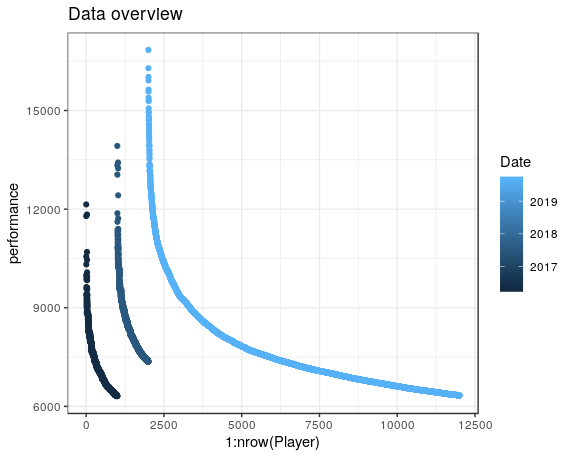
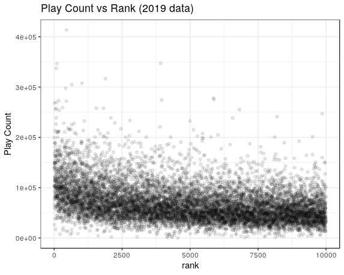
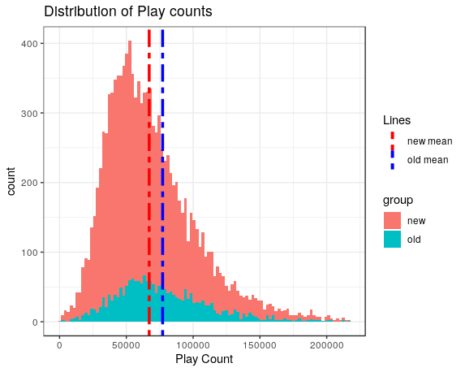
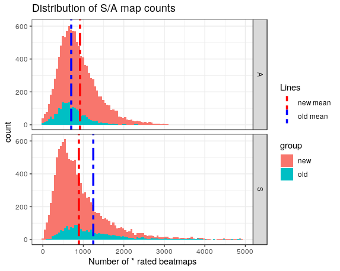
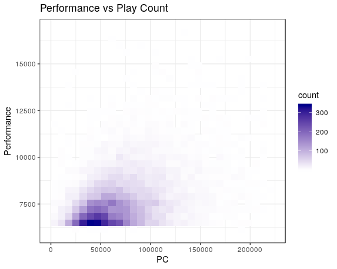
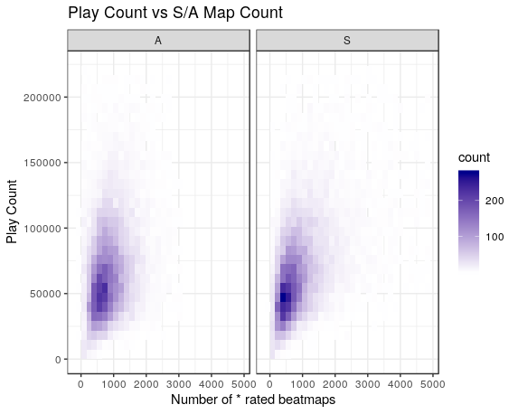
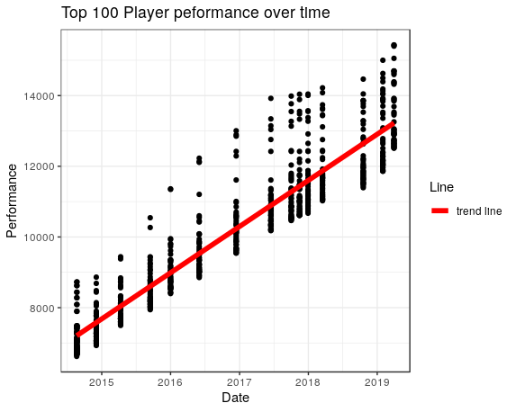
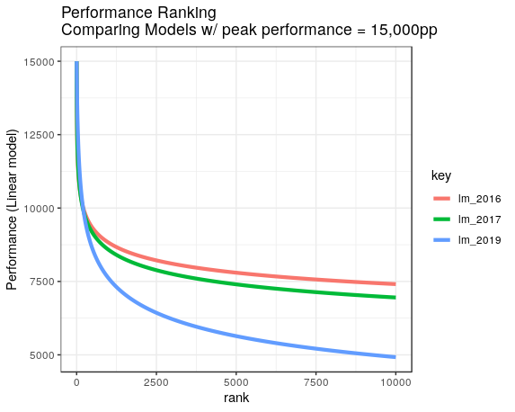
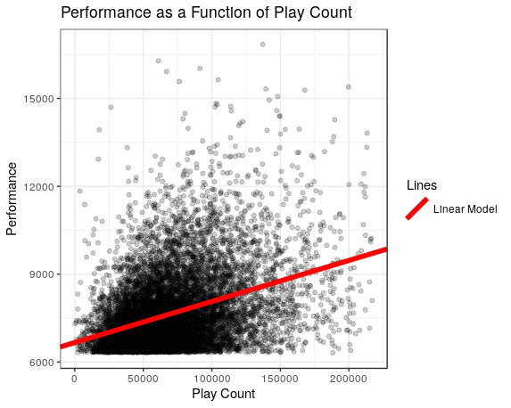

## Overview

This is a summary of the analysis I did on Performance Ranking (Leaderboard). For more in depth view of my analysis, check the `notebook_v2.Rmd` found in the `R Code` folder of this repo. 

I am assuming the reader has a general idea of the game of [Osu!](https://osu.ppy.sh/home). That means I don't need to explain things like player performance, play count, and SS/S/A rated beatmap counts. 

The original goal of this analysis was to understand what factors influenced Player performance. 

## Introduction. 

The data i've collected comes straigh from the Performance Rankings found in the site. Along with the most recent ranking information, I was able to get data from 2016 and 2017 Performance Ranking. 

I was limited to what's available through the WayBack Machine. Note, web-scraping was involved. More information can be found in the `Python Folder`. 

Here is basic plot of rank against performance (for those curious): 

We also have some histograms 

and some heatmaps

This is kind of an aside, but I have some data of the top 100 rankings from 2014 to 2019. 

Clearly, the peak performance acheived increases over the years, and it is surprisingly linear. 

## Models

I modeled performance as a function of rank. This is kind of usefule for seeing how performance disparity in the top 10,000 ranking changes over time. I bet one can make something interesting out of it given how peak performance grows over the years. 

The biggest thing to note is growth in performance disparity over time. That is, we get a bigger dip in the curves. 

I also modeled performance as a function of play count. Performance shared the greatest correlation with Play count.

I dabbled with modeling performance as a linear function of play count and number of `SS/S/A` rated beatmaps. I didn't find a good use for it yet.

## Discussion

The analysis thus far has mostly been exploratory, and I have not acheived my goal yet. I believe beatmap leaderboard might be enlightening. It could reveal something about player preferences and performance. 

In the 'in-depth analysis', I made claims about performance inflation over time. The claim had to do with the idea that older/retired players could in theory be very competitive in today's leaderboards. I would need to do some case-studies to back up this claim. The issue with comparing old and new data is like comparing baseball statistics from 1999 and 2019. Clearly, it's really hard to compare when there is differences in the talent pool of the time. 

