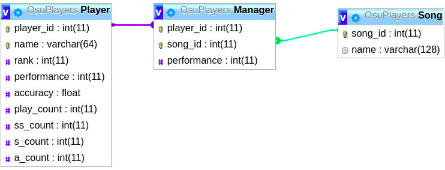
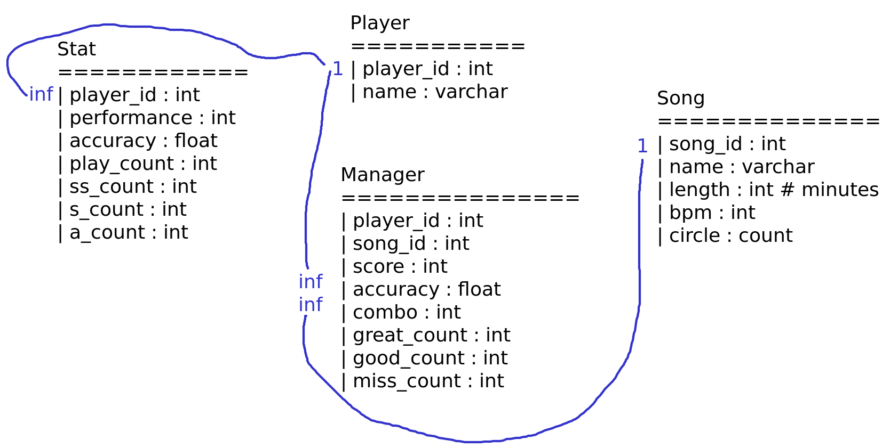

#Overview of Dataset naming and Database Organization

This text briefly describes the meaning behind our naming. This text also contains an extensive overview of the Relational database design (RDB) and the MySQL involved in this project. This project uses a local database to store, interact, and retrieve the osu! data. 

## File hierarchy
================================================

Text files with names `osu_20XX` demonstrate the raw text from the data extraction. Data was extracted by hand from the side osu.ppy.sh. Text files with file names `osu_20XX_data` are the formatted versions of `osu_20XX files`. The key difference is the line by line structure. The lines of `osu_20XX` are like disjointed rows. The lines of `osu_20XX_data` are much more readable. That is, `osu_20XX_data` serves as a intermediate step for data reading. The data is ready with python

##File hierarchy : Python Code
================================================

Module `format_data.py` is used to format the `osu_20XX files`. 
Module `extract_data.py` is used to make use of the new `osu_20XX_data` files.
Module `read_collect_fill_db` makes use of `extract_data.py` to fill the local MySQL database with content. It's really meant to be used occasionally since it systematically imports data into the database. A config.json is used to obtain the credentials for access. 

##File hierarchy : Comments
================================================
osu_2016 and osu_2017 not like the other two. These files only have text noise like parentheses, pound-keys, and some unneeded punctuation. Hence why there are two format functions in `format_data.py`.
osu_2018 and osu_2019 has disjointed lines. Again, this disjointed feature is a result of copying the osu!  Ranking data by hand and pasting it to a text file.
We have two different types of noise because the website updated it’s web-pages between 2017 and 2018. 

- Information is reduced down for *my* sake.

##Databases : Early version
================================================
The earliest version of the database was based on the following requirements:
- Player and player-data to be one giant table
  - It was difficult to write python code that can systematically enter data into the database.
- Players should be indexed by their player_id or their name. 
- A Songs table should have a many-to-many relationship with Player table. 
  - Having data of this type might be helpful some data analysis. 
- A song should have index-able via song_id or name
  - name might be abbreviated. 

To answer the second requirement, a new table called Manager had to be implemented. This resolved the many-to-many relationship. The Manger table will hold the following information:
- player_id
- song_id
- performance

In an attempt to have a more "accurate" data models, I wanted to have archived data. This data includes data from the years 2016, 2017, and 2018. I decided to just have a stand-alone tables for each year. It will have the same structure as Player table, but it won't have any relationships with other tables. 

**Refer to early_mySQL_code.txt for the code implemented and early_RDB_design.png for design view. 

##Databases : Second version
================================================
I realized rank is a useless column if we have performance. Logically, a player's rank is based on their performance. If one wanted to have a player's rank, they should sort data by performance (descending). There is also an issue with needing to update data. A player's rank changes daily and if not hourly. As I extract data from osu.ppy.sh (by hand), a player's rank changes *while I'm extracting*. It's therefore trivial to hold rank information. 

For the sake for better data models, we would like table Manager to hold the following:
- player_id
- song_id
- performance
- score (new)
- accuracy (new)
- (combo information) (new)

In the last version, I did not consider retired players. I want to combine all the names (retired or not) from tables Player (2019), Player2018, Player2017, and Player2016. Some names will overlap but some wont. In the cases where we do have overlap, we can store old information about that player in a Stat ( or "Archive") table. That was I can have the current and old data of these users. This has the advantage of not wasting creating tables with pseudo-overlapping information. That is, 

This in turn will make sql queries a bit more complex. 

In this design, I wanted to have more information about a song. The extra information like song length, beats-per-minute (bpm), and circle count will only be used in exploratory data analysis. I don’t expect to make a model around song and individual player performance. There is way too much information to consider in that venture. Furthermore, I’d need 1000+ songs.
 
I did extend the number of columns in the Manager Table. This is just extra information that is also for exploratory purposes. 

This design has yet to be implemented.

